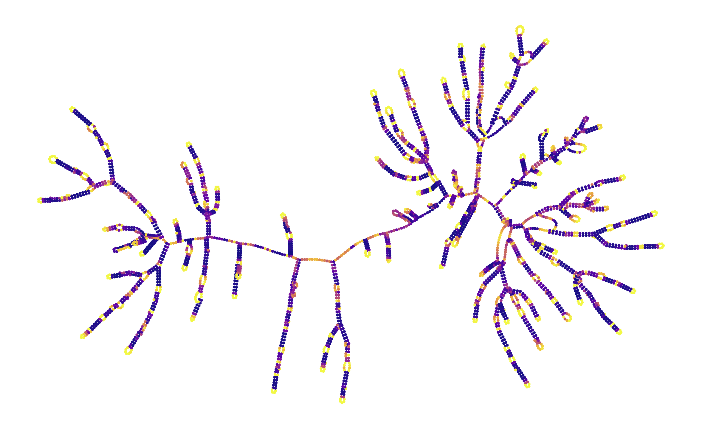
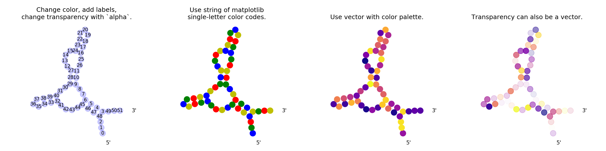

# RiboGraphViz

(c) 2020 Leland Stanford Jr University

Authors:
Hannah Wayment-Steele

Python tool for visualizing global properties of sets of many large RNAs.

Note: Not intended for detailed layouts -- loops may switch orientation in z-axis.



*Above*: MS2 bacteriophage genome structure, colored by prob(unpaired), calculated in EternaFold.

*Below*: Visualizing the MFE structure and p(unpaired) of an mRNA for eGFP, at increasing temperatures in Vienna.


To set up:
```
pip install -r requirements.txt
python setup.py install
```

See `examples.ipynb` for example usage.



*Below*: Vienna MFE structures of 20 randomly-generated RNAs.

