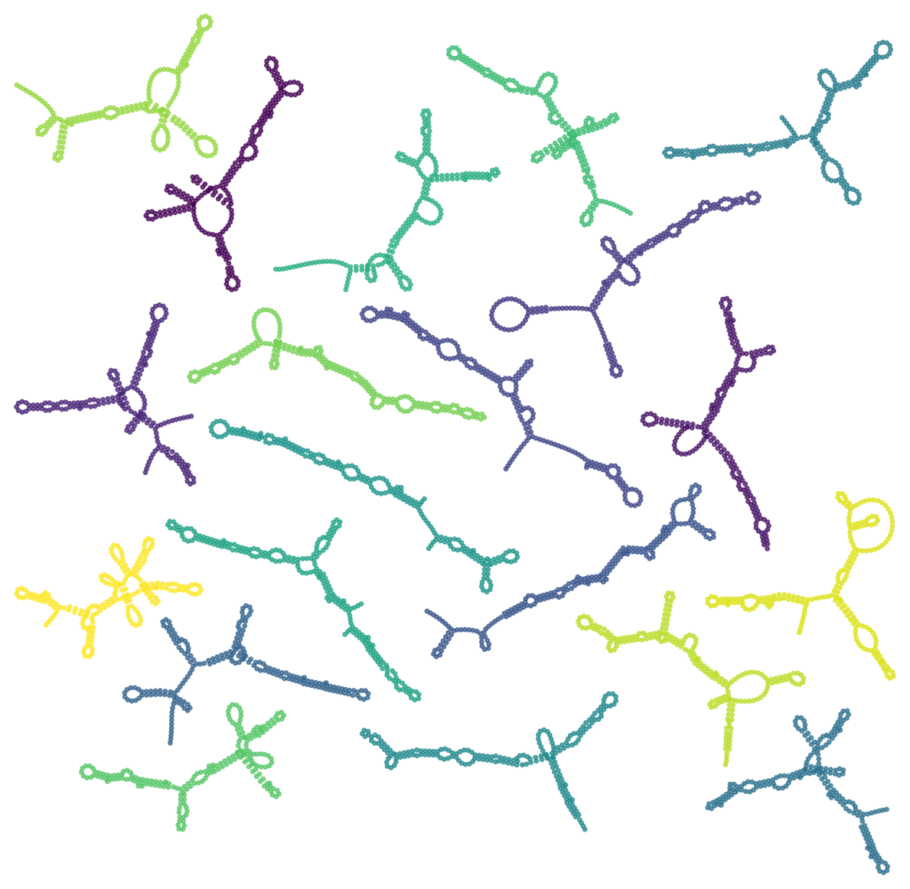
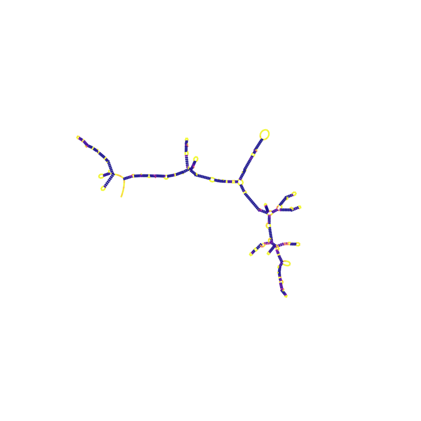

# RiboGraphViz

(c) 2020 Leland Stanford Jr University

Authors:
Hannah Wayment-Steele

Python tool for visualizing global properties of sets of many large RNAs.
Note: Not intended for detailed layouts -- loops may switch orientation in z-axis.

Represent an RNA secondary structure using a force-directed layout from GraphViz.
Also calculates topology features of secondary structures, like Maximum Ladder Distance, number of hairpins, and more.

See `RiboGraphViz_demo.ipynb` for example usage and how to generate above images.

